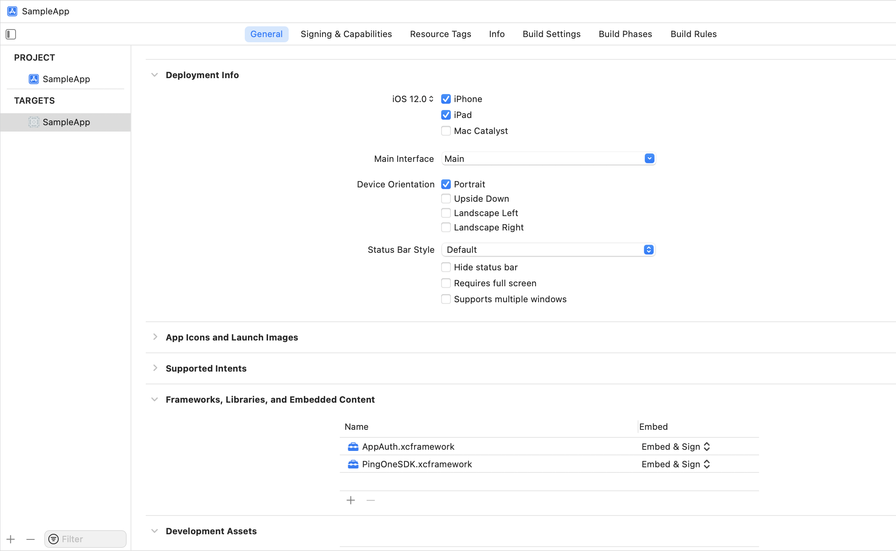

# PingOne for Customers Mobile SDK

## Overview

PingOne for Customers Mobile SDK is a set of components and services targeted at enabling organizations to include multifactor authentication (MFA) into native applications.
This solution leverages Ping Identity’s expertise in MFA technology, as a component that can be embedded easily and quickly into a new or existing application. The PingOne for Customers Mobile SDK package comprises of the following components:

* The PingOne for Customers Mobile SDK library for iOS applications.
* A sample app example source code for iOS.

Release notes can be found [here](./release-notes.md).

### Documentation

Reference documentation is available for PingOne for Customers Mobile SDK, describing its capabilities, features, installation and setup, integration with mobile apps, deployment and more: 

* [PingOne for Customers Mobile SDK release notes and admin related documentation](https://documentation.pingidentity.com/pingone/p14cAdminGuide/)
* [PingOne for Customers Mobile SDK developer documentation](https://apidocs.pingidentity.com/pingone/customer/v1/api/mobileSDK/)


## Set up a mobile app using the PingOne SDK sample code

### Prerequisites

Prepare the iOS push messaging mandatory data from Apple Developer portal:

* Key ID
* Team ID
* Token .p8 file
* Bundle ID

Refer to: [Establishing a Token-Based Connection to APNs](https://developer.apple.com/documentation/usernotifications/setting_up_a_remote_notification_server/establishing_a_token-based_connection_to_apns).


### Configure iOS push messaging on the PingOne Portal

#### iOS Push Notification:

When configuring your PingOne SDK application in the PingOne admin web console (**Connections > Applications > {NATIVE application} > Edit > Authenticator**), you should upload your .p8 token and fill in the Key ID, Team ID and Bundle ID. See [Edit an application](https://documentation.pingidentity.com/pingone/p14cAdminGuide/index.shtml#p1_t_editApplication.html) in the administration guide.


### Xcode integration

**Note:** PingOne SDK supports the following software versions:

* Xcode 11 and above.
* iOS 10.0 and above.


#### Add the PingOne SDK component into your existing project

1. In your **Project Navigator**, click on your target, and drag **PingOne.xcframework** to **Frameworks, Libraries, and Embedded Content**.
2. Check the **Copy items if needed** checkbox.

    


3. Integrate the PingOne SDK component into your code:
	* Import the framework into your application initialization code:<br>`import PingOne`

### Pairing

To manually pair the device, call the following method with your pairing key:

```swift
@objc public static func pair(_ pairingKey: String, completionHandler: @escaping (NSError?) -> Void)
```

To automatically pair the device using OpenID Connect:

1. call this function to get the PingOne SDK mobile payload:
```swift
@objc public static func generateMobilePayload() throws -> String
```
2. pass the received mobile payload on the OIDC request as the value of query param: `mobilePayload`
3. call this function with the ID token after the OIDC authentication completes:
```swift
@objc public static func processIdToken(_ idToken: String, completionHandler: @escaping (_ pairingObject: PairingObject?, _ error: NSError?) -> Void)
```

### Working with push messages in iOS

This section details the steps needed in order to work with push messages in iOS:

* Enable **Push Notifications**: Go to your Project Navigator’s **capabilities** tab. Select **Push Notifications > Enable**.
* Enable **Remote Notifications**: Go to your Project Navigator’s **capabilities** tab. Turn on **Background Modes > Remote notifications**.
* Enable **Push Notifications** in Apple Developer Account > Certificates, Identifiers & Profiles > Identifiers > Capabilities > Push Notifications > Enable and upload your p8 key.
* Enter your app’s **Deployment Details** settings in your Apple Developer Account > Certificates, Identifiers & Profiles > Identifiers > Your App ID. These details are now mandatory prerequisites for Apple to register your device for push notifications.

#### Register device token on PingOne server

In order to receive push notifications from PingOne SDK, use the following code in your `didRegisterForRemoteNotificationsWithDeviceToken` call, passing the deviceToken as is:

```swift
@objc public static func setDeviceToken(_ deviceToken: Data, type: APNSDeviceTokenType, completionHandler: @escaping (_ error: NSError?) -> Void)
```

### Handling Push Notifications

PingOne SDK will only handle push notifications which were issued by the PingOne SDK server. For other push notifications, `NSError` with the code `10002, unrecognizedRemoteNotification` will be returned.

The `APNSDeviceTokenType` should be set like this:

```swift
var deviceTokenType : PingOne.APNSDeviceTokenType = .production
#if DEBUG
deviceTokenType = .sandbox
#endif
```

Inside the following AppDelegate method:

```swift
optional func application(_ application: UIApplication,
didReceiveRemoteNotification userInfo: [AnyHashable : Any],
fetchCompletionHandler completionHandler: @escaping (UIBackgroundFetchResult) -> Void)
```

Call:

```swift
@objc public static func processRemoteNotification(_ userInfo: [AnyHashable : Any], completionHandler: @escaping (_ notificationObject: NotificationObject?, _ error: NSError?) -> Void)
```

and pass it the `userInfo` as is.

#### Push Notifications Categories:

PingOne SDK uses categories for different notifications. If your app already uses categories, you will need to retrieve the PingOne SDK categories `Set<UNNotificationCategory>`, by calling:    

```swift
@objc public static func getUNNotificationCategories() -> Set<UNNotificationCategory>
```

and add them to your current categories, for example:

```swift
let center  = UNUserNotificationCenter.current()
center.delegate = self
center.requestAuthorization(options: [.sound, .alert, .badge]) { (granted, error) in
    if error == nil
    {
        // Registering UNNotificationCategory more than once results in previous categories being overwritten. PingOne provides the needed categories. The developer may add categories.
        UNUserNotificationCenter.current().setNotificationCategories(PingOne.getUNNotificationCategories())
        DispatchQueue.main.async {
            UIApplication.shared.registerForRemoteNotifications()
        }
    }
}
```


#### Localization

The following keys are returned by the PingOne SDK Remote Notification, with suggested localization:

```swift
"notification.confirm"  = "Approve";
"notification.deny"     = "Deny";
"notification.message"  = "You have a new authentication request.";
"notification.title"    = "New Authentication";
```

**Note:** An example of these keys is provided in the sample app, in the `Localizable.strings` file.

### Keychain Sharing

**Note:** This step is required only if your app uses Keychain Sharing.
Make sure that the first item on your Keychain Groups is `YOUR_BUNDLE_ID` (your private keychain group). This requirement will ensure that the SDK keychain values are private, and are not shared between apps​:


### PingOne Mobile SDK sample app

The PingOne Mobile SDK bundle provides a sample app that includes all the basic flows in order to help you get started.

### Send logs

```swift
// Call this method if you want to send logs to the PingOne support team.
PingOne.sendLogs { (supportId, error) in
    if let supportId = supportId{
        print("Support ID:\(supportId)")
        }
    }
    else if let error = error{
        print("error sending logs: \(error.debugDescription)")
    }
}
```

## Disclaimer

THE SAMPLE CODE IS PROVIDED "AS IS", WITHOUT WARRANTY OF ANY KIND, EXPRESS OR
IMPLIED, INCLUDING BUT NOT LIMITED TO THE WARRANTIES OF MERCHANTABILITY,
FITNESS FOR A PARTICULAR PURPOSE AND NONINFRINGEMENT. IN NO EVENT SHALL THE
AUTHORS OR COPYRIGHT HOLDERS BE LIABLE FOR ANY CLAIM, DAMAGES OR OTHER
LIABILITY, WHETHER IN AN ACTION OF CONTRACT, TORT OR OTHERWISE, ARISING FROM,
OUT OF OR IN CONNECTION WITH THE SAMPLE CODE OR THE USE OR OTHER DEALINGS IN
THE SAMPLE CODE.  FURTHERMORE, THIS SAMPLE CODE IS NOT COMMERCIALLY SUPPORTED BY PING IDENTITY BUT QUESTIONS MAY BE ADDRESSED TO PING'S SUPPORT CENTER OR MAY BE OTHERWISE ADDRESSED IN THE RELATED DOCUMENTATION.

Any questions or issues should go to the support center, or may be discussed in the [Ping Identity developer communities](https://community.pingidentity.com/collaborate).
