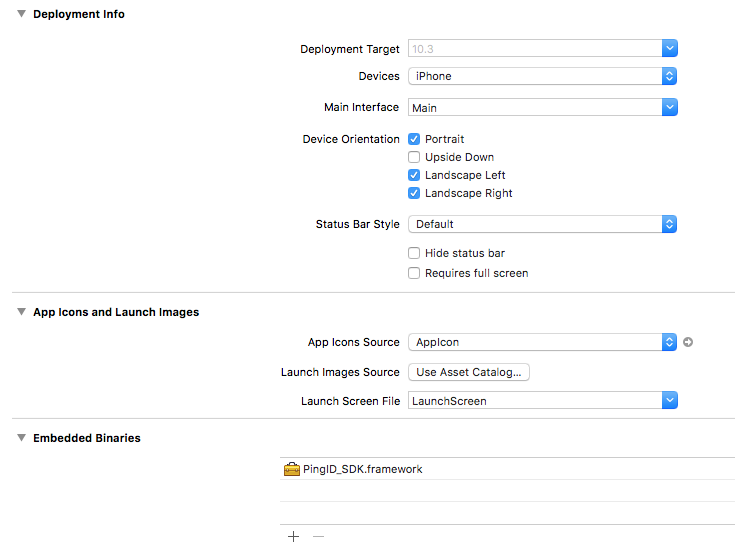
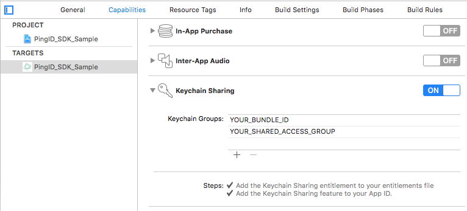

## Set up a mobile app using the PingOne SDK sample code

### Prerequisites

Prepare the iOS push messaging mandatory data from Apple Developer portal:

* Key ID
* Team ID
* Token .p8 file
* Bundle ID

Refer to: [Establishing a Token-Based Connection to APNs](https://developer.apple.com/documentation/usernotifications/setting_up_a_remote_notification_server/establishing_a_token-based_connection_to_apns).


### Configure iOS push messaging on the PingOne Portal

#### iOS Push Notification:

When configuring your PingOne SDK application in the PingOne admin web console (**Connections > Applications > {application} > Edit > Authenticator**), you should upload your .p8 token and fill in the Key ID, Team ID and Bundle ID. See [Edit an application](https://documentation.pingidentity.com/pingone/p14cAdminGuide/index.shtml#p1_t_editApplication.html) in the administration guide.


### Xcode integration

**Note:** PingOne SDK supports the following software versions:

* Xcode 10.2 and above.
* iOS 10.0 and above.


#### Add the PingOne SDK component into your existing project

1. In your **Project Navigator**, click on your target, and drag **PingOne.framework** to **Embedded Binaries**.
2. Check the **Copy items if needed** checkbox.

    


3. Integrate the PingOne SDK component into your code:
	* Import the framework into your application initialization code:<br>`import PingOne`

#### Setup the Run Script phase

**Note:** Due to an [App Store submission bug](http://www.openradar.me/radar?id=6409498411401216), binaries containing simulator slices can’t be uploaded to the App Store. 

The following steps solve this issue:

* Select your application’s Xcode **project**, then your **application target**, and then select **Build Phases**, click “**+**”, and then **New Run Script Build Phase**.
* Make sure that the Run Script phase is after the Embed Frameworks phase.
* Paste the following line into the body of the **Run Script Build Phase**:

	```bash
	bash "${BUILT_PRODUCTS_DIR}/${FRAMEWORKS_FOLDER_PATH}/PingOne.framework/strip-frameworks.sh"
	```
	
	


 
### Pairing

To pair the device, call the following method with your pairing key:

```
@objc public static func pair(_ pairingKey: String, completionHandler: @escaping (NSError?) -> Void)
```

### Working with push messages in iOS

This section details the steps needed in order to work with push messages in iOS:

* Enable **Push Notifications**: Go to your Project Navigator’s **capabilities** tab. Select **Push Notifications > Enable**.
* Enable **Remote Notifications**: Go to your Project Navigator’s **capabilities** tab. Turn on **Background Modes > Remote notifications**.


#### Register device token on PingOne server

In order to receive push notifications from PingOne SDK, use the following code in your `didRegisterForRemoteNotificationsWithDeviceToken` call, passing the deviceToken as is:

```
@objc public static func setDeviceToken(_ deviceToken: Data, type: APNSDeviceTokenType, completionHandler: @escaping (_ error: NSError?) -> Void)
```
 
### Handling Push Notifications

PingOne SDK will only handle push notifications which were issued by the PingOne SDK server. For other push notifications, `NSError` with the code `10002, unrecognizedRemoteNotification` will be returned.

The `APNSDeviceTokenType` should be set like this:

```
      var deviceTokenType : PingOne.APNSDeviceTokenType = .production
        #if DEBUG
        deviceTokenType = .sandbox
        #endif
```

Inside the following AppDelegate method:

```
optional func application(_ application: UIApplication, 
didReceiveRemoteNotification userInfo: [AnyHashable : Any], 
   fetchCompletionHandler completionHandler: @escaping (UIBackgroundFetchResult) -> Void)
```

Call:

```
    @objc public static func processRemoteNotification(_ userInfo: [AnyHashable : Any], completionHandler: @escaping (_ notificationObject: NotificationObject?, _ error: NSError?) -> Void)
```

and pass it the `userInfo` as is.

#### Push Notifications Categories:

PingOne SDK uses categories for different notifications. If your app already uses categories, you will need to retrieve the PingOne SDK categories `Set<UNNotificationCategory>`, by calling:    

```
@objc public static func getUNNotificationCategories() -> Set<UNNotificationCategory>
```

and add them to your current categories, for example:

```
        let center  = UNUserNotificationCenter.current()
        center.delegate = self
        center.requestAuthorization(options: [.sound, .alert, .badge]) { (granted, error) in
            if error == nil
            {
                // Registering UNNotificationCategory more than once results in previous categories being overwritten. PingOne provides the needed categories. The developer may add categories.
                UNUserNotificationCenter.current().setNotificationCategories(PingOne.getUNNotificationCategories())
                DispatchQueue.main.async {
                    UIApplication.shared.registerForRemoteNotifications()
                }
            }
        }
        
```


#### Localization

The following keys are returned by the PingOne SDK Remote Notification, with suggested localization:

```
"notification.confirm"  = "Approve";
"notification.deny"     = "Deny";
"notification.message"  = "You have a new authentication request.";
"notification.title"    = "New Authentication";
```

**Note:** An example of these keys is provided in the sample app, in the `Localizable.strings` file.
        
### Keychain Sharing

**Note:** This step is required only if your app uses Keychain Sharing.
Make sure that the first item on your Keychain Groups is `YOUR_BUNDLE_ID` (your private keychain group). This requirement will ensure that the SDK keychain values are private, and are not shared between apps​:





### PingOne Mobile SDK sample app

The PingOne Mobile SDK bundle provides a sample app that includes all the basic flows in order to help you get started.


